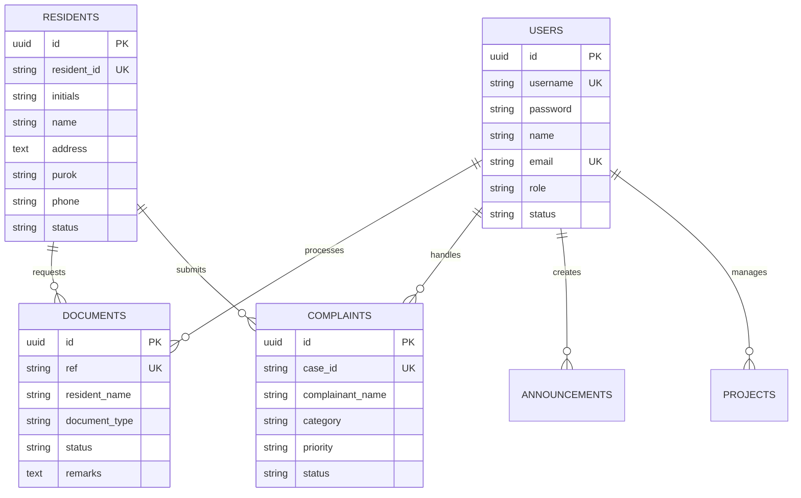

# Payatas Ledger - System Design Documentation

## Overview

**Payatas Ledger** is a Civic Management System designed for barangay (village) administration in the Philippines. It provides a comprehensive web-based platform for managing resident information, processing document requests, handling complaints, tracking community projects, and disseminating announcements.

---

## 1. System Architecture

### 1.1 High-Level Architecture

The system uses a **Single Page Application (SPA)** architecture with **dual storage** capabilities:

```
┌────────────────────────────────────────────────────────────────────┐
│                        CLIENT LAYER                                 │
│  ┌─────────────┐  ┌─────────────┐  ┌─────────────┐                 │
│  │   Browser  │  │   Mobile   │  │   Tablet   │                 │
│  │  (Chrome,  │  │  (Chrome,  │  │  (Safari,  │                 │
│  │   Firefox) │  │   Safari)  │  │   Chrome)  │                 │
│  └──────┬──────┘  └──────┬──────┘  └──────┬──────┘                 │
│         └──────────────────┼──────────────────┘                         │
│                          ▼                                          │
│  ┌─────────────────────────────────────────────────────────────────┐│
│  │              PRESENTATION LAYER                                   ││
│  │  HTML5 + CSS3 (Custom Variables) + Material Symbols              ││
│  └─────────────────────────────────────────────────────────────────┘│
└────────────────────────────────────────────────────────────────────┘
           │
           ▼
┌───────────────────────────────────────────────────────────────────────┐
│                  APPLICATION LAYER                             │
│  ┌───────────────────────────────────────────────────────────┐│
  │              Application Logic (ES6+ Vanilla)             ││
  │  - admin.html / js/app.js (Internal Administration)       ││
  │  - index.html / js/landing.js (Public Citizen Portal)     ││
  │  - supabase-config.js (Data Connector)                    ││
  │  └───────────────────────────────────────────────────────────┘│
  └───────────────────────────────────────────────────────────┘│
└───────────────────────────────────────────────────────────┘
           │
           ▼
┌───────────────────────────────────────────────────────────────────────┐
│                    DATA LAYER                           │
│  ┌───────────────────────────────────────────────┐         │
│  │          DUAL STORAGE SYSTEM                 │         │
│  │                                         │         │
│  │  ┌─────────────────┐  ┌───────────┐ │         │
│  │  │  LOCALSTORAGE │  │SUPABASE  │ │         │
│  │  │   (Offline)  │  │ (Online) │ │         │
│  │  └────────┬──────┘  └────┬────┘ │         │
│  │           │              │      │         │
│  └──────────┼──────────────┼──────┘         │
│            │              │                  │
│  Mode detection: Automatic fallback based on    │
│  Supabase SDK availability                   │
│  └───────────────────────────────────────────────┘
└───────────────────────────────────────────────────────────────────────┘
```

### 1.2 Technology Stack

| Layer | Technology | Specification |
|-------|-------------|---------|
| Markup | HTML5 | Semantic, Accessible |
| Styling | CSS3 | Custom Properties, Flex/Grid |
| Scripting | JavaScript | Vanilla ES6+ |
| Database | Supabase | PostgreSQL + Real-time |
| Fonts | Public Sans | Headings (700-900) |
| Fonts | Inter | Body (Regular-SemiBold) |
| Icons | Material Symbols | Outlined Style |

---

## 2. Application Flow

### 2.1 Authentication Flow

```
App Load → Check Session Existence
        │
        ├─→ No Session ──→ Show Login Screen
        │
        └─→ Has Session ──→ Show Main App + Initialize Components
                              │
                              ▼
                      User Enters Credentials
                              │
                              ▼
                    Validate Credentials
                              │
                    ┌────────┴────────┐
                    │             │
              Invalid         Valid
                    │             │
                    ▼             ▼
             Show Error    Store Session
                              │
                              ▼
                        Show Main App
```

### 2.2 Page Navigation (SPA Router)

```
Sidebar Nav Click
        │
        ▼
showPage(pageId) Function
        │
        ▼
Hide All .page Elements (remove 'active' class)
        │
        ▼
Add 'active' Class to Target Page
        │
        ▼
Update Nav Items (update 'active' state)
        │
        ▼
Render Page Data (if applicable)
```

---

## 3. Data Models

### 3.1 Entity Relationship



### 3.2 Data Object Schemas

#### User
```javascript
{
  id: "USR-001",
  username: "admin",
  password: "admin123",
  name: "Admin Payatas",
  email: "admin@payatas.gov.ph",
  role: "Super Administrator",
  status: "Active"
}
```

#### Resident
```javascript
{
  id: "PAY-001",
  initials: "MS",
  name: "Mateo Santos",
  address: "124 Orchid St. Phase 2",
  purok: "Purok 4",
  phone: "+63 917 555 0192",
  email: "mateo@payatas.ph",
  status: "Active"
}
```

#### Document
```javascript
{
  ref: "PAY-2026-878337",
  resident: "Saint Laurel Santiago",
  type: "Barangay Clearance",
  date: "2026-04-07",
  status: "Approved",
  remarks: "please proceed to the main office claim it the clearance"
}
```

---

## 4. Module Design

### 4.1 Core Modules (app.js)

| Module | Lines | Responsibility |
|--------|-------|--------------|
| Global Data | 8-76 | Data stores, fallback defaults |
| Authentication | 79-128 | Login, logout, session management |
| Navigation | 130-150 | SPA page routing |
| Initialization | 152-183 | App startup, render functions |
| Render Functions | 185-332 | Table/grid rendering |
| UI Components | 334-370 | Modal, toast, reusable |
| Modal Forms | 372-532 | Form modals for CRUD |
| Document Actions | 533-564 | Doc operations |
| User Actions | 565-602 | User management |
| Resident Actions | 603-634 | Resident management |
| Export | 635-701 | CSV export |
| Notifications | 702-750 | Notifications, profile |
| Filters | 751-803 | Search, filter |

### 4.2 Page Modules

| Page | Features |
|------|----------|
| Dashboard | Stats grid, quick actions, recent activity |
| Residents | CRUD, search, status filter, export |
| Documents | Request processing, approval workflow |
| Complaints | Filing, priority levels, status tracking |
| Projects | Card grid, progress bars, budget display |
| Announcements | Card grid, category tags |
| Reports | Summary tables, export |
| Users | User CRUD, role management (admin) |
| Settings | Configuration toggles |

---

## 5. UI/UX Design Decisions

### 5.1 Layout Structure

```
┌──────────────────────────────────────────────────────────┐
│              LOGIN SCREEN                         │
│   ┌──────────────────────────────────────────┐  │
│   │     Logo + Title + Subtitle             │  │
│   ├──────────────────────────────────────────┤  │
│   │  [Username Input]                   │  │
│   │  [Password Input] + [Toggle]        │  │
│   ├──────────────────────────────────────────┤  │
│   │  
